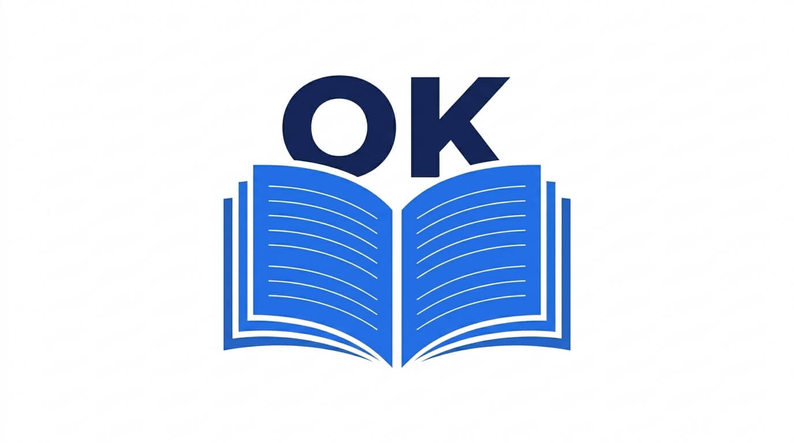

<div align="center">



# TypesetOK Website & Editorial Showcase
### אתר תדמית וסדנת עימוד מקצועית בקוד פתוח | Official Website & Live Interactive Playground

[](https://github.com/TypesetOK/website/actions/workflows/ci.yml)
[](https://github.com/TypesetOK/website/actions/workflows/deploy-pages.yml)
[](https://typesetok.github.io/website/)
[](https://github.com/TypesetOK/typesetok/blob/main/LICENSE.md)
[-blue.svg)]()
[]()
[]()

<p align="center">
  <b>[ <a href="#-עברית">עברית</a> | <a href="#-english">English</a> ]</b>
</p>

</div>

---

## 🇮🇱 עברית

### 📖 אודות האתר והקונספט
ריפו זה מכיל את קוד המקור של אתר התדמית וההדגמה הרשמי של **TypesetOK (TOK)** — מפרט ארכיטקטוני ותשתית מחקר בקוד פתוח לעימוד ופרסום שולחני (DTP) לטיפוגרפיה עברית מתקדמת, ספרי קודש (ש"ס, מקראות גדולות ושו"ת) ומסמכי ענק.
פותח ומוביל: **[Amlaach](https://amlaach.github.io/personal-site/)**.

האתר עוצב ותוכנת לפי קונספט **Editorial Technology** — ממשק אינטראקטיבי המעביר את תחושת הטיפוגרפיה והעימוד החי דרך החוויה עצמה, ללא הסתמכות על דפי נחיתה שיווקיים גנריים. האתר מותאם להרצה מלאה כאתר סטטי ב-**GitHub Pages**, כולל תמיכה ב-4 שפות (עברית, אנגלית, ספרדית, צרפתית), מצב כהה כברירת מחדל, וסרגל נגישות מקיף (WCAG 2.2 AA).

---

### 🌟 רכיבים אינטראקטיביים מרכזיים

1. **לוח הגהה מונוגרפי ב-Hero (Editorial Monograph Specimen):**
   * תצוגת מופת דפוס חיה של פרק א' במשנה (ברכות), משולבת קווי ייחוס טיפוגרפיים, נרמול ת"י 6100 ואיזון שורות.
   * מתג גריד ייעודי לבחינת קווי היסוד הדפוסאיים.

2. **גלילת סיפור טיפוגרפי (Scroll Storytelling):**
   * **סצנה 1:** נרמול קפדני לפי תקן ישראלי ת"י 6100 וגימטריה דטרמיניסטית (15 $\rightarrow$ ט״ו, 16 $\rightarrow$ ט״ז).
   * **סצנה 2:** פותר אילוצים רב-תזרימי (Talmud Solver) לעמודי ש"ס ומקראות גדולות (גמרא, רש"י ותוספות).
   * **סצנה 3:** קדם-דפוס נייטיב ISO 15930 (PDF/X-1a) עם שחור 100% K DeviceCMYK, פרופיל Fogra 39 וטבלאות `/ToUnicode`.

3. **מעבדת עימוד אינטראקטיבית (Typography Playground):**
   * שליטה בזמן אמת בגודל אות, רווח שורות (Leading), חלוקת טורים, רווח בין טורים, ומדרג יישור עברי (אהלתר"ם).
   * סרגלי מידה מדויקים (מילימטרים / A4) ומתג לרשת קווי בסיס (Baseline Grid).

4. **סליידר השוואה לפני/אחרי (Before / After Comparison):**
   * השוואה ויזואלית בין מעבד תמלילים רגיל (וורד) לבין בלוק העימוד המהודק של TypesetOK.
   * כפתורי Presets מהירים (Word / 50% / TypesetOK), תמיכה במגע, עכבר ומקלדת (מקשי חצים, Home/End) בשפות RTL ו-LTR.

5. **הדמיית סביבת עבודה שולחנית (Product Workbench Preview):**
   * עץ צמתים סמנטי (TDM Node Tree) המעדכן מאפייני אלמנטים בזמן אמת.
   * סמן וירטואלי ברינדור 120 FPS ופאנל בדיקות קדם-דפוס חי (Live Preflight).

6. **Bento Grid חכם ליכולות המערכת:**
   * 7 כרטיסיות אסימטריות המפרטות את הארכיטקטורה: Rust Core, SI 6100, 3-Tier Justification, Multi-Flow, Prepress, ACID WAL Storage, Holy Name Guardian.

7. **צינור זרימת העבודה (Pipeline with Progressive Disclosure):**
   * 5 שלבי עימוד אינטראקטיביים עם מפרט טכני מתרחב בלחיצה.

8. **לוח בנצ'מרק ובדיקות אמת מאומתות:**
   * נתונים אמיתיים מתוך ריפו ה-Rust (58/58 בדיקות עוברות, Clippy 0 אזהרות, דטרמיניזם ביט-אחר-ביט, עמידה במבחן עומס של 1,000 עמודים).

---

### ♿ נגישות (WCAG 2.2 AA) וביצועים (Core Web Vitals)

* **ניווט מקלדת מלא:** קישור Skip Link, חיווי `:focus-visible` בולט, וסמנטיקת ARIA מלאה.
* **הפחתת תנועה (Reduced Motion):** תמיכה בהעדפת מערכת הפעלה (`prefers-reduced-motion`) לצד מתג ידני עליון באתר הנשמר ב-`localStorage`.
* **מתג רשת גריד טיפוגרפית:** אפשרות להפעיל/לכבות שכבת גריד ועזרי מדידה בכל רחבי האתר.
* **אפס תלויות כבדות:** קוד Vanilla JS ו-CSS מודולרי ללא ספריות ענק (LCP $\le$ 1.2s, INP $\le$ 50ms, CLS = 0).

---

### 🚀 הרצה מקומית

האתר הוא אתר סטטי עצמאי שאינו דורש תהליך בנייה מורכב:

```bash
# הרצה באמצעות שרת ה-HTTP המובנה של Python:
python -m http.server 8000

# פתיחה בדפדפן:
# http://localhost:8000
```

---

## 🇺🇸 English
 
### 📖 About
This repository contains the source code for the official website and interactive showcase of **TypesetOK (TOK)** — an open-source architectural specification and research foundation for desktop publishing (DTP) dedicated to advanced Hebrew typography, sacred texts (Talmud, Mikraot Gedolot, Responsa), and large-scale manuscripts.
Lead Developer: **[Amlaach](https://amlaach.github.io/personal-site/)**.

The site is designed under the **Editorial Technology** concept, turning the physical world of typography, baseline grids, and pre-press standards into an interactive, accessible digital surface. It is fully static, deployed directly to **GitHub Pages**, with dark mode as default, 4 languages (Hebrew, US English, Spanish, French), and an accessible toolbar (WCAG 2.2 AA).

---

### 🛠️ GitHub Actions CI & Pages Deployment

* **Continuous Integration (`.github/workflows/ci.yml`):**
  * Automated linting and tag well-formedness validation.
  * Broken asset & link verification.
  * CSS & JS syntax tree checks.
* **Automated GitHub Pages Deployment (`.github/workflows/deploy-pages.yml`):**
  * Automatically deploys on every push to `main`.
  * Pre-configured with `.nojekyll` and custom `404.html`.

---

### 📁 Repository Structure

```
website/
├── index.html                   # Semantic HTML5 Master Document (i18n & Schema.org)
├── 404.html                     # Custom Accessible 404 Page (Dark mode default)
├── .nojekyll                    # Disables Jekyll processing on GitHub Pages
├── site.webmanifest             # Web App Manifest
├── robots.txt                   # Search Engine Crawler Directives
├── sitemap.xml                  # Canonical XML Sitemap
├── README.md                    # Dual-language Documentation
│
├── .github/
│   └── workflows/
│       ├── ci.yml               # Automated CI Validation Pipeline
│       └── deploy-pages.yml     # Automated GitHub Pages Deployment
│
├── scripts/
│   └── validate.py              # CI Quality & Integrity Checker
│
└── assets/
    ├── images/
    │   ├── logo.jpg             # TypesetOK Brand Logo (Open Book + OK)
    │   └── favicon.svg          # Crisp Vector Favicon
    ├── css/
    │   ├── tokens.css           # Design Tokens (Colors, Typography, Dark Default)
    │   ├── reset.css            # Accessible RTL Reset
    │   ├── main.css             # Editorial Grid & Layout Primitives
    │   ├── components.css       # Interactive Modules & Demos (Fluid mobile-safe)
    │   └── a11y-motion.css      # WCAG 2.2 AA Toolbar & Reduced Motion Overrides
    └── js/
        ├── main.js              # Navigation, Observers & Modals
        ├── i18n.js              # Multi-lingual Engine (HE, EN, ES, FR)
        ├── a11y.js              # Universal Accessibility Controller (12 features)
        ├── playground.js        # Interactive Typography Playground
        ├── before-after.js      # Accessible Fluid Comparison Slider & Presets
        └── workbench.js         # Desktop Workbench & TDM Inspector
```

---

### 📄 License

This repository and the TypesetOK project are licensed under the:
**[TypesetOK Source-Available Non-Commercial Copyleft License (TOK-NCCL v1.0)](https://github.com/TypesetOK/typesetok/blob/main/LICENSE.md)**

